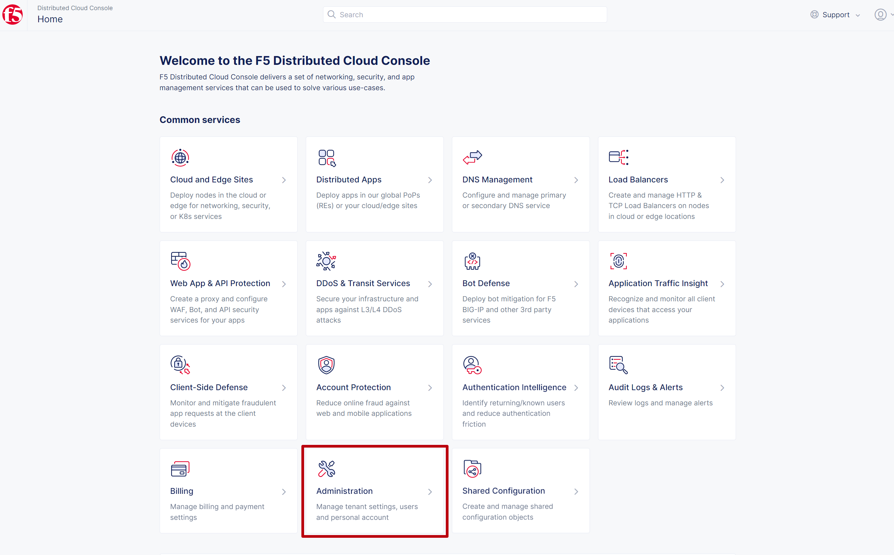

Installation instructions
------------ 

Install ansible galaxy collections and python dependencies:
 
```shell
  ansible-galaxy collection install yoctoalex.xc_cloud_modules
  ansible-galaxy collection install kubernetes.core
  ansible-galaxy collection install community.kubernetes
  ansible-galaxy collection install cloud.common
  pip3 install kubernetes
```

Create API Token. Navigate to the **Administration** page.
  

  
Then open **Credentials** tab and click **Add Credentials**
  


Fill details and click **Generate** button
    


Copy generated token to the ansible script in the evironments section. 
Here you can also configure your namespace, tenant, app prefix, etc.

```yaml
  environment:
      XC_API_TOKEN: "your_api_token"
      XC_TENANT: "console.ves.volterra.io"
      
  vars:
      namespace: "starratings"
      prefix: "star-ratings"
      domain: "star-ratings.example.com"
      vk8s: "demo-vk8s"
```

Execute ansible script with following command:

```shell
  ansible-playbook playbook.yaml -i ./hosts
```
